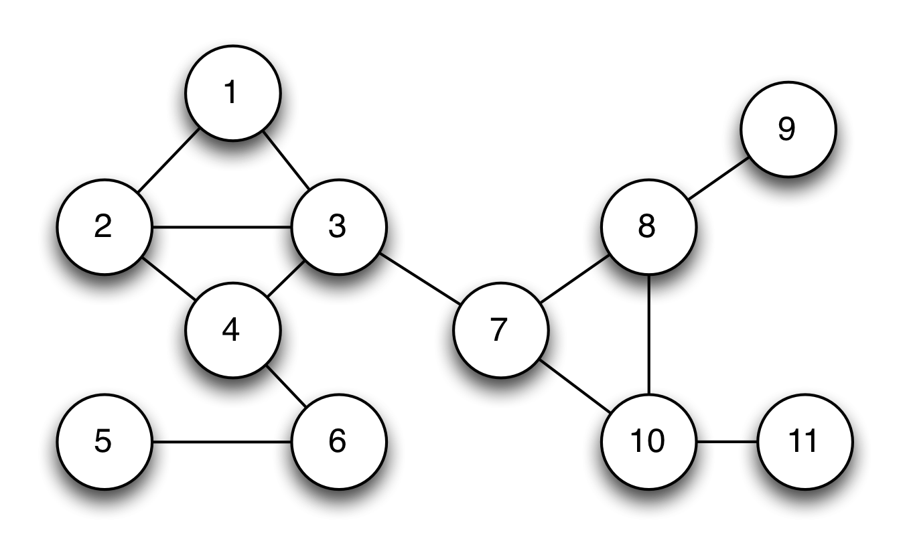

# Zero Knowledge Proofs

> Main article: [Zero Knowledge Proofs: An illustrated primer](https://blog.cryptographyengineering.com/2014/11/27/zero-knowledge-proofs-illustrated-primer/)

## The first rule of modern cryptography is never to trust people who claim such things without proof.

## Overview

The notion of **zero knowledge** was first proposed in the 1980s by MIT researchers Shafi Goldwasser, Silvio Micali and Charles Rackoff. You can find it with these keywords.

That time, most work in this area focused the **soundness** of the proof system.

It considered the case where a malicious **Prover** attempts to ‘trick’ a **Verifier** into believing a false statement: What happens if you don’t trust the Verifier?

> "Soundness: Let φ1, φ2,...,φn and ψ be propositional logic formulas. If φ1, φ2,...,φn ψ is valid, then φ1, φ2,...,φn ψ holds." [credit](https://www.amazon.com/Logic-Computer-Science-Modelling-Reasoning/dp/052154310X)

### The problems

How much extra information is the Verifier going to learn during the course of this proof, thus this statement is true?

Let's see an example. In most real systems (2023), when logging, the clients input their password, then the **raw passwords** were transmitted to the server. Servers will calculate (most, put them into hash function) passwords, then compare **encoded passwords** with **also encoded passwords** stored in database.

-> Why servers have privilege to know client's info?

-> With the innovation of AI, whether hackers can take advantage of this to attack servers?

ZKPs can solve these problems

### A "real world" example

Imagine the network structure is represented by the graph below.

Each vertex in this graph represents a telecom tower.

The connecting lines (edges) indicate tower's transmissions are likely to interfere with each other.

If adjacent towers use the same bandwidth, it can be conflicted
So if we use three different frequency, the network will work normally.
Theory problem called the graph three-coloring problem.

If this network was very large and complex, so much so that the computing power at my disposal was not sufficient to find a solution. In this instance, I might hire my friends at Google to solve it for me on spec.

But this leads to a problem.

Suppose that Google devotes a large percentage of their computing infrastructure to searching for a valid coloring for my graph. I’m certainly not going to pay them until I know that they really have such a coloring.

At the same time, Google isn’t going to give me a copy of their solution until I’ve paid up. We’ll wind up at an impasse.

In real life there’s probably a common-sense answer to this dilemma, one that involves lawyers and escrow accounts. But this is not a blog about real life, it’s a blog about cryptography. And if you’ve ever read a crypto paper, you’ll understand that the right way to solve this problem is to dream up an absolutely crazy technical solution.

### A crazy technical solution (with hats!)

Summary, with the problem above. The solution includes some concepts:

1. Google cover all tower with **hats**, make sure the client not have info about the color of each tower.
2. When the client testing, Google will show randomly some towers and their colors that proved Google is not lying.
3. The loop will be ended util step **2** made enough large (~ E^2), so client can be confident to pay money for Google

> Please follow [main article for this solution](https://blog.cryptographyengineering.com/2014/11/27/zero-knowledge-proofs-illustrated-primer/) for more information. [Demo](http://web.mit.edu/~ezyang/Public/graph/svg.html)

## What makes it **zero knowledge**?

The first rule of modern cryptography is never to trust people who claim such things without proof.

Goldwasser, Micali and Rackoff proposed three following properties that every zero-knowledge protocol must satisfy. Stated informally, they are:

**1. Completeness**: If Google is telling the truth, then they will eventually convince me (at least with high probability).

**2. Soundness**: Google can only convince me if they’re actually telling the truth.

**3. Zero-knowledgeness**: I don’t learn anything else about Google’s solution. (hard part, we need to conduct a very strange thought experiment.)

> If you don't know **Completeness** and **Soundness**, you should follow [this book](https://www.amazon.com/Logic-Computer-Science-Modelling-Reasoning/dp/052154310X) - chapter **1.4 Semantics of propositional logic** (p.45, p.49)

> Vietnamese: Completeness: "Nếu nó đúng thì nó chứng minh được", Soundness: "Nếu nó chứng minh được thì nó đúng"

### A thought experiment (with time machines)
> This prototype is turned out and have some limitations but can use to trick this problem.

Since Google doesn’t actually know a valid coloring for the graph, they’ll simply color the paper with a bunch of random colors, then put the hats on. 
If by sheer luck, I challenge them on a pair of vertices that happen to be different colors.

Whenever Google finds themselves in this awkward situation, they simply fix it. That is, a designated employee pulls a switch, ‘rewinds’ time about four minutes, and the Google team recolors the graph with a completely new random solution. Now they let time roll forward and try again.

In effect, the time machine allows Google to ‘repair’ any accidents that happen during their bogus protocol execution, which makes the experience look totally legitimate to me. Since bad challenge results will occur only 1/3 of the time, the expected runtime of the protocol (from Google’s perspective) is only moderately greater than the time it takes to run the honest protocol. From my perspective I don’t even know that the extra time machine trips are happening.

This last point is the most important. In fact, from my perspective, being unaware that the time machine is in the picture, the resulting interaction is exactly the same as the real thing. It’s statistically identical. And yet it’s worth pointing out again that in the time machine version, Google has absolutely no information about how to color the graph.

### What the hell is the point of this?
> Sorry, but in this section I must clone all of **main article**...

What we’ve just shown is an example of a simulation. Note that in a world where time runs only forward and nobody can trick me with a time machine, the hat-based protocol is correct and sound, meaning that after E^2 rounds I should be convinced (with all but negligible probability) that the graph really is colorable and that Google is putting valid inputs into the protocol.

What we’ve just shown is that if time doesn’t run only forward — specifically, if Google can ‘rewind’ my view of time — then they can fake a valid protocol run even if they have no information at all about the actual graph coloring.

From my perspective, what’s the difference between the two protocol transcripts? When we consider the statistical distribution of the two, there’s no difference at all. Both convey exactly the same amount of useful information.

Believe it or not, this proves something very important.

Specifically, assume that I (the Verifier) have some strategy that ‘extracts’ useful information about Google’s coloring after observing an execution of the honest protocol. Then my strategy should work equally well in the case where I’m being fooled with a time machine. The protocol runs are, from my perspective, statistically identical. I physically cannot tell the difference.

Thus if the amount of information I can extract is identical in the ‘real experiment’ and the ‘time machine experiment’, yet the amount of information Google puts into the ‘time machine’ experiment is exactly zero — then this implies that even in the real world the protocol must not leak any useful information.

Thus it remains only to show that computer scientists have time machines.

