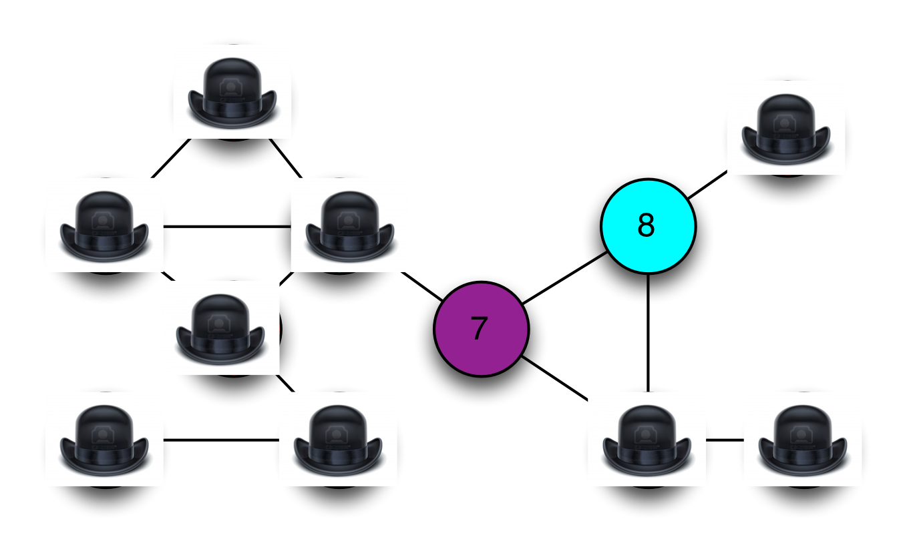
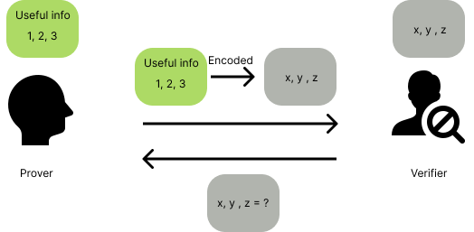

# Overview

The notion of **zero knowledge** was first proposed in the 1980s by MIT researchers Shafi Goldwasser, Silvio Micali and Charles Rackoff. 
That time, most work in this area focused the **soundness** of the proof system. It considered the case where a malicious **Prover** attempts to ‘trick’ a **Verifier** into believing a false statement: What happens if you don’t trust the Verifier?

> ***Soundness***: you should follow [this book](https://www.amazon.com/Logic-Computer-Science-Modelling-Reasoning/dp/052154310X) - chapter **1.4 Semantics of propositional logic** (p.45, p.49)

### The problems

How much extra information is the Verifier going to learn during the course of this proof, thus this statement is true?

Let's see an example. In most real systems (2023), when logging, the clients input their password, then the "raw passwords" were transmitted to the server. Servers will calculate (most, put them into hash function) passwords, then compare "encoded passwords" with "also encoded passwords" stored in database.

-> Why servers have privilege to know client's info, whether hackers can take advantage of this to analysis the habit of creating the clients's passwords?
### A "real world" example

Imagine the network structure is represented by the graph below.Each vertex in this graph represents a telecom tower. The connecting lines (edges) indicate tower's transmissions are likely to interfere with each other.

If adjacent towers use the same bandwidth, it can be conflicted
So if we use three different frequency, the network will work normally. Theory problem called the graph three-coloring problem.

If this network was very large and complex, so much so that the computing power at my disposal was not sufficient to find a solution. In this instance, I might hire my friends at Google to solve it for me on spec.

But this leads to a problem.

Suppose that Google devotes a large percentage of their computing infrastructure to searching for a valid coloring for my graph. I’m certainly not going to pay them until I know that they really have such a coloring.

At the same time, Google isn’t going to give me a copy of their solution until I’ve paid up. We’ll wind up at an impasse.
### A crazy technical solution (with hats!)

The solution includes some concepts:

1. Google cover all tower with **hats**, make sure the client not have info about the color of each tower.
2. When the client testing, Google will show randomly some towers and their colors that proved Google is not lying.
3. The loop will be ended util step **2** made enough large (~ E^2), so client can be confident to pay money for Google

> Please follow [main article](https://blog.cryptographyengineering.com/2014/11/27/zero-knowledge-proofs-illustrated-primer/) 
for more information.

### What makes it **"zero knowledge"**?

The first rule of modern cryptography is never to trust people who claim such things without proof.

Goldwasser, Micali and Rackoff proposed three following properties that every zero-knowledge protocol must satisfy. Stated informally, they are:
1. **Completeness**: If Google is telling the truth, then they will eventually convince me (at least with high probability).

2. **Soundness**: Google can only convince me if they’re actually telling the truth.
3. **Zero-knowledgeness**: I don’t learn anything else about Google’s solution. (hard part, we need to conduct a very strange thought experiment.)

> **Completeness** and **Soundness**: you should follow [this book](https://www.amazon.com/Logic-Computer-Science-Modelling-Reasoning/dp/052154310X) - chapter **1.4 Semantics of propositional logic** (p.45, p.49)

### A thought experiment (with time machines)
There is an example of `simulation`. Imagine that Google doesn’t actually know a valid coloring for the graph. Whenever I pull off a pair of hats, there is a designated Googler pulls a switch, ‘rewinds’ time about four minutes, and the Google team recolors the graph with a completely new random solution. Now they let time roll forward and try again. It called time machine. From my perspective I don’t even know that the extra time machine trips are happening.

### What the hell is the point of this?
Note that in a world where time runs only forward and nobody can trick me with a time machine, the hat-based protocol is correct and sound, meaning that after E^2 rounds I should be convinced (with all but negligible probability) that the graph really is colorable and that Google is putting valid inputs into the protocol.

If time doesn’t run only forward, if Google can ‘rewind’ my view of time — then they can fake a valid protocol run even if they have no information at all about the actual graph coloring?

From my perspective, what’s the difference between the two protocol transcripts? When we consider the statistical distribution of the two, there’s no difference at all. Both convey exactly the same amount of useful information.

Specifically, assume that I (the Verifier) have some strategy that ‘extracts’ useful information about Google’s coloring after observing an execution of the honest protocol. Then my strategy should work equally well in the case where I’m being fooled with a time machine. The protocol runs are, from my perspective, statistically identical. I physically cannot tell the difference.

Thus if the amount of information I can extract is identical in the ‘real experiment’ and the ‘time machine experiment’, yet the amount of information Google puts into the ‘time machine’ experiment is exactly zero — then this implies that even in the real world the protocol must not leak any useful information.

### Getting rid of the hats (and time machines)
Of course we don’t actually want to run a protocol with hats. And even Google (probably?) doesn’t have a literal time machine.

To tie things together, we first need to bring our protocol into the digital world. This requires that we construct the digital equivalent of a ‘hat’: ***something*** that both hides a digital value, while simultaneously ‘binding’ (or ‘committing’) the maker to it, so she can’t change her mind after the fact.

Fortunately we have a perfect tool for this application. It’s called a digital commitment scheme. A commitment scheme allows one party to ‘commit’ to a given message while keeping it secret, and then later ‘open’ the resulting commitment to reveal what’s inside. They can be built out of various ingredients, including (strong) cryptographic hash functions.

Given a commitment scheme, we now have all the ingredients we need to run the zero knowledge protocol electronically. The Prover first encodes its vertex colorings as a set of digital messages (for example, the numbers 0, 1, 2), then generates digital commitments to each one. These commitments get sent over to the Verifier. When the Verifier challenges on an edge, the Prover simply reveals the opening values for the commitments corresponding to the two vertices.

So we’ve managed to eliminate the hats. But how do we prove that this protocol is **"zero knowledge"**?

Fortunately now that we’re in the digital world, we no longer need a real time machine to prove things about this protocol. A key trick is to specify in our setting that the protocol is not going to be run between two people, but rather between two different computer programs (or, to be more formal, probabilistic Turing machines.)

What we can now prove is the following theorem: if you could ever come up with a computer program (for the Verifier) that extracts useful information after participating in a run of the protocol, then it would be possible to use a ‘time machine’ on that program in order to make it extract the same amount of useful information from a ‘fake’ run of the protocol where the Prover doesn’t put in any information to begin with.

`Ultimately what we get is the following theorem. If there exists any Verifier computer program that successfully extracts information by interactively running this protocol with some Prover, then we can simply use the rewinding trick on that program to commit to a random solution, then ‘trick’ the Verifier by rewinding its execution whenever we can’t answer its challenge correctly. The same logic holds as we gave above: if such a Verifier succeeds in extracting information after running the real protocol, then it should be able to extract the same amount of information from the simulated, rewinding-based protocol. But since there’s no information going into the simulated protocol, there’s no information to extract. Thus the information the Verifier can extract must always be zero.`

### So what does this all mean?
We know that the protocol is complete and sound, based on our analysis above. The soundness argument holds in any situation where we know that nobody is fiddling with time — that is, the Verifier is running normally and nobody is rewinding its execution.

At the same time, the protocol is also zero knowledge. To prove this, we showed that any Verifier program that succeeds in extracting information must also be able to extract information from a protocol run where rewinding is used and no information is available in the first place. Which leads to an obvious contradiction, and tells us that the protocol can’t leak information in either situation.

There’s an important benefit to all this. Since it’s trivial for anyone to ‘fake’ a protocol transcript, even after Google proves to me that they have a solution, I can’t re-play a recording of the protocol transcript to prove anything to anyone else (say, a judge). That’s because the judge would have no guarantee that the video was recorded honestly, and that I didn’t simply edit in the same way Google might have done using the time machine. This means that protocol transcripts themselves contain no information. The protocol is only meaningful if I myself participated, and I can be sure that it happened in real time.

# Proving section will be updated....

[Ref](https://blog.cryptographyengineering.com/2014/11/27/zero-knowledge-proofs-illustrated-primer/)

