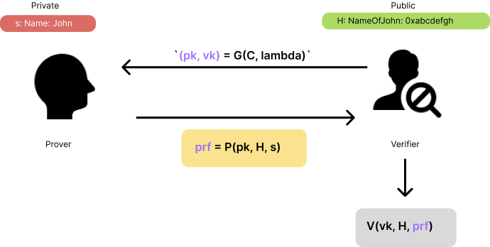

# Introduction to zk-SNARKs
> SNARK = Succinct Non-interactive ARguments of Knowledge

> For brief


## Zero-knowledge proofs
The goal of zero-knowledge proofs is for a verifier to be able to convince herself that a prover possesses knowledge of a secret parameter, called a witness, satisfying some relation, without revealing the witness to the verifier or anyone else.

We can think of this more concretely as having a program, denoted `C` (commitment), taking two inputs: `C(x, w)`. The input `x` is the public input, and `w` is the secret witness input. The output of the program is `boolean`, i.e. either true or false. The goal then is given a specific public input x, prove that the prover knows a secret input `w` such that `C(x,w) == true`.

We are specifically going to discuss `non-interactive zero knowledge proofs`, which means that the proof itself is a blob of data that can be verified without any interaction from the prover.

## Example program
Suppose Bob is given a hash `H` of some value, and he wishes to have a proof that Alice knows the value `s` that hashes to H. **Normally** Alice would prove this by giving `s` to Bob, after which Bob would compute the hash and check that it equals `H`.

However, suppose Alice doesn’t want to reveal the value `s` to Bob but instead she just wants to prove that she knows the value. She can use a `zk-SNARK` for this.

We can describe Alice’s scenario using the following program, here written as a Javascript function:

```js
function C(x, w) {
  return ( sha256(w) == x );
}
```

In other words: the program takes in a public hash `x` and a secret value `w` and returns true if the `SHA–256` hash of `w` equals `x`.

Translating Alice’s problem using the `function C(x,w)` we see that Alice needs to create a **proof** that she possesses `s` such that `C(H, s) == true`, without having to reveal `s`. 


A zk-SNARK consists of three algorithms `G, P, V` defined as follows:

The key generator `G` takes a secret parameter `lambda` and a program `C`, and generates two publicly available keys, a proving key `pk`, and a verification key `vk`. These keys are public parameters that only need to be generated once for a given program `C`.

The prover `P` takes as input the proving key `pk`, a public input `x` and a private witness `w`. The algorithm generates a proof `prf = P(pk, x, w)` that the prover knows a witness w and that the witness satisfies the program.

The verifier `V` computes `V(vk, x, prf)` which returns `true` if the proof is correct, and `false` otherwise. Thus this function returns `true` if the prover knows a witness `w` satisfying `C(x,w) == true`.

Note here the secret parameter `lambda` used in the generator. This parameter sometimes makes it tricky to use `zk-SNARKs` in real-world applications. The reason for this is that anyone who knows this parameter can generate ***fake proofs***. Specifically, given any program `C`and public input `x` a person who knows `lambda` can generate a proof `fake_prf` such that `V(vk, x, fake_prf)` evaluates to `true` without knowledge of the secret `w`.

Thus actually running the generator requires a very secure process to make sure no-one learns about and saves the parameter anywhere. This was the reason for the extremely elaborate ceremony the Zcash team conducted in order to generate the proving key and verification key, while making sure the “toxic waste” parameter lambda was destroyed in the process.

## A zk-SNARK for our example program
How would Alice and Bob use a zk-SNARK in practice in order for Alice to prove that she knows the secret value in the example above?

First of all, as discussed above we will use a program defined by the following function:

```js
function C(x, w) {
  return ( sha256(w) == x );
}
```

The first step is for Bob to run the generator `G` in order to create the proving key `pk` and verification key `vk`. This is done by first randomly generating `lambda` and using that as input:

`(pk, vk) = G(C, lambda)`

As discussed above, the parameter `lambda` must be handled with care, since if Alice learns the value of lambda she will be able to create ***fake proofs**. Bob will share `pk` and `vk` with Alice.

Alice will now play the role of the prover. She needs to prove that she knows the value `s` that hashes to the known hash `H`. She runs the proving algorithm `P` using the inputs `pk`, `H` and `s` to generate the proof prf:

```js
prf = P(pk, H, s)
```

Next Alice presents the proof `prf` to Bob who runs the verification function `V(vk, H, prf)` which would return `true` in this case since Alice properly knew the secret `s`. Bob can be confident that Alice knew the secret, but Alice did not need to reveal the secret to Bob.

